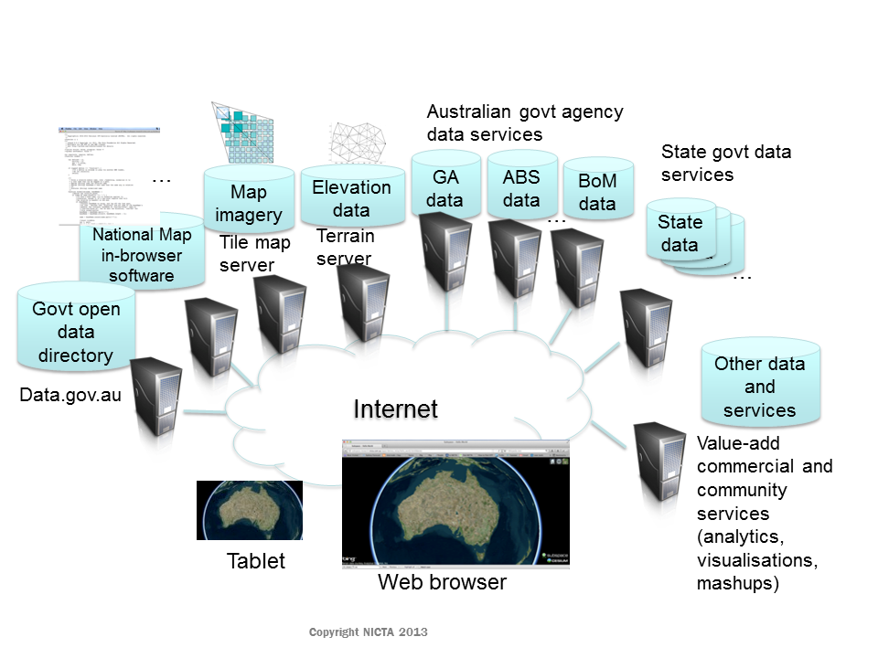
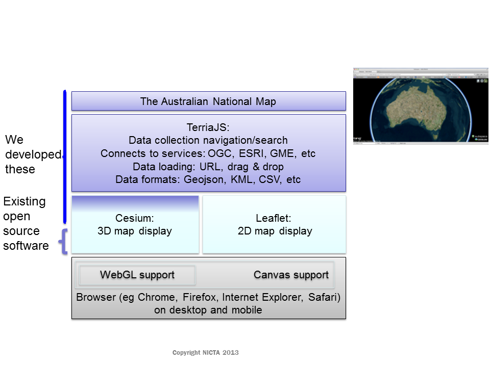

The National Map has an open architecture with all data sets being provided live to the browser by different government agencies.  This means that the data you are viewing is coming directly from a government agency (usually the official custodian of that data or an open data catalogue such as http://data.gov.au).  The overall system architecture is shown in this diagram.
 

The National Map software (developed by NICTA) is a thin layer on top of TerriaJS (also developed by NICTA and with a growing community of other contributors). This uses Cesium for 3D geospatial rendering and Leaflet for 2D geospatial rendering.  The architecture looks roughly like this.

