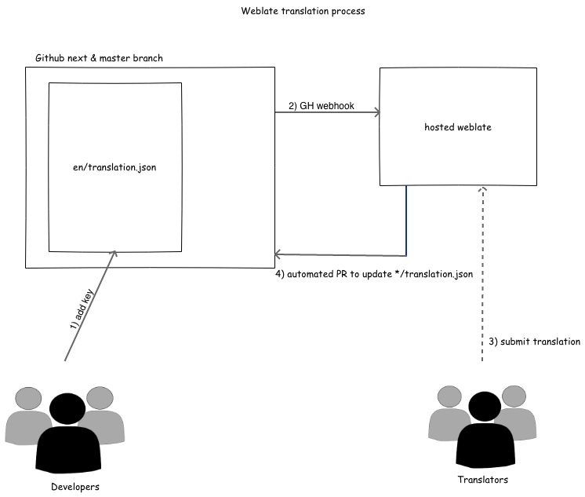

# 7. Use weblate for i18n

Date: 2021-05-07

## Status

Accepted

## Context

We have a request to provide a french translationed version of de-africa. We are using the i18next and i18next-react libraries with all our UI strings within en/translation.json. There are also two long life branches master & next representing our current production release (v7) and the next production release (v8). Due to the time lag between releases, there are hundreds more strings in the v8 translation.json versus the master (v7) version.

It would not be workable or scalable for translators to provide these translations into the github repository directly as this requires a level of technical expertise and we won't have an easy way of keeping track of which strings haven't been translated yet. We also require some quality check mechanism to ensure the quality of the contributed translations.

## Decision

We will use hosted weblate at https://hosted.weblate.org/projects/terriajs/ to allow external translators to contribute to the project. There will be two projects, one connected to the master branch and another connected to the next branch.

When the en/translation.json is updated, our weblate plugin and associated webhook will let the hosted weblate know and weblate will pull the updated changes. When a contributing translator provides translations, weblate will create a PR into the corresponding branch allowing a terria maintainer to review the changes before merging the changes.

In the case of a change to a source string within the en/translation.json file, weblate will automatically flag the string as 'needs editing' in the other languages.

For new (lang_code)/translation.json files, the initial import will cause the translated strings to show up within the weblate interface. Once this is done, further translations should be done within the weblate interface as it will allow us to keep track of the translation progress and keep it in sync with the main en/translation.json file.

As part of the v8 release, we will merge the v7 and v8 translation files together to retain the work of our translation community and post v8 release, we will have only one single weblate project to avoid confusion in the future.

## Consequences

This will allow external translators to contribute translations via the hosted weblate interface. Weblate will also tell us what percentage of strings are translated and provide a workflow for reviewing translations before merging back in.

This will tie our translation process into the weblate ecosystem which is a paid service and will also add additional complexity to terriajs. This is also currently only set up for terriajs and will require additional set up to provide translations for map specific strings. We also do not have RTL language set up and additional work will be required to support these langauges.

As we currently have two weblate components projects set up representing master & next, we have the current risk of duplication and conflict if two different translators provide translations for the same key.
