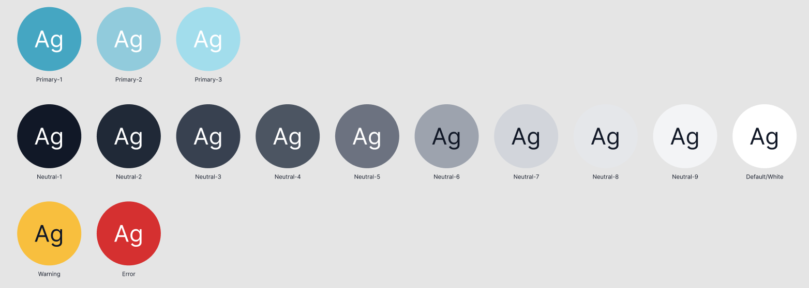

# 13. Adopt styles from demo map fork

Date: 2024-12-12

## Status

Proposed

## Context

A large number of changes were made to a terriajs fork to produce the demo at https://map.terria.io/ 

After positive feedback we wish to adopt these changes to `terriajs` while maintaining customisation via config.

This can be carried out in stages to reduce impact:

1. Adopt padding and font size changes first
2. Introduce new color palette renaming existing variables
3. Change to "floating workbench"

### Fonts and Padding
Currently sizes and spacing are defined in two places:

`_variables.scss`:
- `font-size-small`
- `$padding: 10px;`

`Text.scss` / `Box.scss`:
- `props.extraExtraLarge` 
- `props.paddedRatio`

These should be defined in one place (`_variables.scss`) and accessed via `useTheme`.

[ ] **TBD: Padding / margin do we stick with 5px multiples?**

### Colours
Currently Colours are mainly defined in `_variables.scss` but lots of components have discrete colours inline or in their stylesheet.

Have all colours named in `_variables.scss`. The existing naming convention is sometimes color specific and inconsistent i.e. `grey` , `text-black`. Instead the following variables will be defined:

[ ] **TBD: Do we want to have usage names as well? i.e. `$workbench-bg: $neutral-4`**

## Decision

## Consequences
- Simplified and consistent UI
- Lose some of the more fine grained customisation available
- Some existing maps will need updating to adapt to new theme