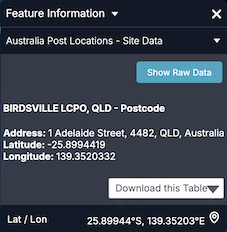

# Feature Information Template

You can add a `featureInfoTemplate` to the items in your catalog `json` file like so:

```json
{
  "catalog": [
    {
      "type": "csv",
      "name": "Australia Post Locations",
      "url": "https://tiles.terria.io/static/auspost-locations.csv",
      "activeStyle": "State",
      "id": "YUeesYKH",
      "featureInfoTemplate": {
        "template": "<h4>{{Name}}, {{State}} - Postcode</h4><div><strong>Address: </strong>{{Address Line 1}}, {{Postcode}}, {{State}}, {{Country Name}}</div><div><strong>Latitude: </strong>{{Lat}}</div><div><strong>Longitude: </strong>{{Lon}}</div></p>"
      }
    }
  ]
}
```

The template will replace all occurrences of `{{property}}` with the value of the property for that feature.

The result is:



instead of:


You can provide a template to use for the name of the collapsible section (eg. to replace `Site name` in the example above), like so:

```json
"featureInfoTemplate" : {
    "template": "<div>Name: {{Name}}</div>",
    "name": "{{Type}}, {{Name}}, {{State}} - Postcode",
}
```

Users will see a button show raw data so they still can see the default feature info template.

## More details

The template is rendered using [Mustache](https://github.com/janl/mustache.js#usage), so you can use all of its features here.

In particular, you can render properties that include html by using triple-braces, eg. `{{{property}}}`.

You can make use of partial templates (and even recursive templates) by specifying your template and partials as a json object, eg.:

```json
"featureInfoTemplate" : {
    "template": "<div>Address: {{>address}}</div>",
    "partials": {
        "address": "<b>{{Address Line 1}}, {{Postcode}}, {{State}}, {{Country Name}}</b>"
    }
}
```

After Mustache has rendered the template, the result is displayed using [Markdown](https://help.github.com/articles/markdown-basics/), so you could also write:

```json
"featureInfoTemplate" : {
    "template": "Address: **{{Address Line 1}}, {{Postcode}}, {{State}}, {{Country Name}}**"
}
```

## Formatting numbers

The preferred way to format numbers is using the `formats` option, eg:

```json
"featureInfoTemplate": {
  "template": "Coordinates: <b>Lat={{Lat}} Lon={{Lon}}</b>.",
  "formats": {
    "Lat": {
      "type": "number",
      "maximumFractionDigits": 3
    },
    "Lon": {
      "type": "number",
      "maximumFractionDigits": 3
    }
  }
}
```

`"type"` specifies the type of formatting that will be applied to the property. Here we are using `"number"` formatting which is also the default formatting if `"type"` is not supplied.

The supported format options are:

- `"maximumFractionDigits": X`: To reduce the number of decimal places to a maximum of X digits.
- `"minimumFractionDigits": X`: To increase the number of decimal places to a minimum of X digits.
- `"useGrouping": true`: To show thousands separators.

A second method is to use `terria.formatNumber` directly in the template. This accepts an initial JSON string describing the same options as above. To simplify the notation, the quotes around the keys are optional here.

```json
"featureInfoTemplate": {
  "template": "Location: <b>Lat={{#terria.formatNumber}}{maximumFractionDigits:3}{{Lat}}{{/terria.formatNumber}}</b>."
}
```

## URL-encoding strings

To URL-encode a value in a template, use `terria.urlEncode` or `terria.urlEncodeComponent`. For example:

```
    Test: {{#terria.urlEncode}}http://example.com/a b{{/terria.urlEncode}}
    Test: {{#terria.urlEncodeComponent}}W/HOE#1{{/terria.urlEncodeComponent}}
```

## Formatting dates

Similar to formatting numbers you can format dates in the `"formats"` section by suppliying `"dateTime"` in the `"type"` property, eg:

```json
"featureInfoTemplate": {
  "template": "Date: {{Date}}",
  "formats": {
    "Date": {
      "type": "dateTime",
      "format": "dd-mm-yyyy HH:MM:ss"
    }
  }
}
```

The date format style used for the `"format"` property is the style from the [npm dateformat package](https://www.npmjs.com/package/dateformat#usage), e.g. `"dd-mm-yyyy HH:MM:ss"` or `"isoDateTime"`.

As with number you can also use `terria.formatDateTime` directly in the template. This accepts an initial JSON string describing the same options as above.

```json
"featureInfoTemplate": {
  "template": "{{#terria.formatDateTime}}{format: \"dd-mm-yyyy HH:MM:ss\"}2017-11-23T08:47:53Z{{/terria.formatDateTime}}</b>."
}
```

## Replace text

You can replace text by directly using `terria.partialByName` in the template and providing partials for matching and replacement. For example, with the following template and partials,

- If the value of `feature.data.layerId` matches a property name in the `partials`, it will be replaced by corresponding value.
- If there is no matching in the `partials`, the original value will be used.
- Any unsafe values in the `partials` will be stripped off when being rendered.

```json
"featureInfoTemplate": {
  "template": "{{Pixel Value}} dwellings in {{#terria.partialByName}}{{feature.data.layerId}}{{/terria.partialByName}} radius.",
  "partials": {
    "0": "100m",
    "1": "500m",
    "2": "1km",
    "3": "2km"
  }
}
```

If `{{Pixel Value}}` equals to `150` and `{{feature.data.layerId}}` to `2`, the text `150 dwellings in 1km radius.` will be rendered.

## Time-series charts

For features with time-varying table-based data structures (eg. CSV, SOS2, SDMX-JSON, if there is a time column), the feature info panel also includes a chart of the data over time, eg.


You can place this chart in your template using `{{terria.timeSeries.chart}}`. Alternatively, you can access the following component information:

- `{{terria.timeSeries.xName}}` - the x-column name
- `{{terria.timeSeries.yName}}` - the y-column name
- `{{terria.timeSeries.title}}`
- `{{terria.timeSeries.id}}`
- `{{terria.timeSeries.units}}` - the column units as a comma-separated string.
- `{{terria.timeSeries.data}}` - the data as a comma-separated string.

Please note:

- If any of the component information above contains double-quotes, double quotes will be removed before TerriaJS processes the template further.
- If any of the component information above is used as part of tag attributes, it must be surrounded by double-quotes. e.g. `<chart y-column="{{terria.timeSeries.yName}}"></chart>`

So you could reconstruct the chart manually as:

```jsx
<h4>{{terria.timeSeries.title}}</h4>
<chart x-column="{{terria.timeSeries.xName}}"
       y-column="{{terria.timeSeries.yName}}"
       id="{{terria.timeSeries.id}}"
       column-units="{{terria.timeSeries.units}}">
    {{terria.timeSeries.data}}
</chart>
```

or use this as a basis to customise the chart.

## Other supporting data

The clicked point's latitude and longitude are also available as `{{terria.coords.latitude}}` and `{{terria.coords.longitude}}`.

The current time for the layer is avaliable as `{{terria.currentTime}}`.
