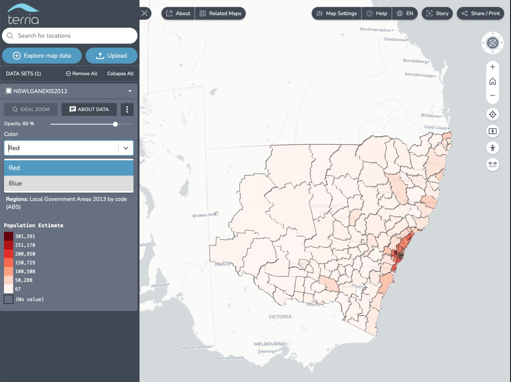

# Model Dimensions

Model dimensions can be used to define dropdown menus in the workbench that update model JSON - think of it as a dropdown that patches the model JSON with a new value. This is useful for changing the appearance of a dataset, such as changing the colourMap for a CSV.

## Basic example

For example - this renders a new drop down called "Color" that changes the `colorPalette` trait - [test link](http://ci.terria.io/main/#clean&start={%22initSources%22%3A[{%22homeCamera%22%3A{%22north%22%3A-8%2C%22east%22%3A158%2C%22south%22%3A-45%2C%22west%22%3A109}%2C%22workbench%22%3A[%22test%22]%2C%22catalog%22%3A[{%22type%22%3A%22csv%22%2C%22url%22%3A%22test%2FNSW_LGA_NEXIS_201212.csv%22%2C%22name%22%3A%22NSWLGANEXIS2012%22%2C%22id%22%3A%22test%22%2C%22modelDimensions%22%3A[{%22id%22%3A%22cols%22%2C%22name%22%3A%22Color%22%2C%22selectedId%22%3A%22Red%22%2C%22options%22%3A[{%22id%22%3A%22Red%22%2C%22value%22%3A{%22defaultStyle%22%3A{%22color%22%3A{%22colorPalette%22%3A%22Reds%22}}}}%2C{%22id%22%3A%22Blue%22%2C%22value%22%3A{%22defaultStyle%22%3A{%22color%22%3A{%22colorPalette%22%3A%22Blues%22}}}}]}]}]}]})

```json
{
  "type": "csv",
  "url": "test/NSW_LGA_NEXIS_201212.csv",
  "name": "NSW LGA NEXIS 2012",
  "modelDimensions": [
    {
      "id": "cols",
      "name": "Color",
      "selectedId": "Red",
      "options": [
        {
          "id": "Red",
          "value": {
            "defaultStyle": {
              "color": {
                "colorPalette": "Reds"
              }
            }
          }
        },
        {
          "id": "Blue",
          "value": {
            "defaultStyle": {
              "color": {
                "colorPalette": "Blues"
              }
            }
          }
        }
      ]
    }
  ]
}
```



## Example with Mustache template

Model dimensions also supports the use of [Mustache templates](https://mustache.github.io/) - this means you can refer to other parts of the model JSON in the value of the model dimension. For example, this changes the `colorPalette` trait:

```json
{
  "type": "csv",
  "url": "test/NSW_LGA_NEXIS_201212.csv",
  "name": "NSW LGA NEXIS 2012",
  "modelDimensions": [
    {
      "id": "Cols",
      "selectedId": "Red",
      "options": [
        {
          "id": "Red",
          "value": {
            "defaultStyle": {
              "color": {
                "colorPalette": "{{modelDimensions.0.selectedId}}"
              }
            }
          }
        },
        {
          "id": "Blue",
          "value": {
            "defaultStyle": {
              "color": {
                "colorPalette": "{{modelDimensions.0.selectedId}}"
              }
            }
          }
        }
      ]
    }
  ]
}
```

This is a silly example - but the template approach means you can have "interaction" between `modelDimensions`

```json
{
    ...,
    "modelDimensions": [
        {
            "id": "some-dim",
            "selectedId": "some-option",
            "options": [
                {
                    "id": "some-option",
                    "value": {
                        "url": "https://example.com/{{modelDimensions.0.selectedId}}-and-{{modelDimensions.1.selectedId}}.geojson"
                    }
                },
                ...
            ]
        }
    ],
    ...
}
```

## Default `selectedId`

It is important to note that the `selectedId` does not apply/update the model JSON when the model is first loaded. So it is best to make sure that the `selectedId` matches your default model JSON.
