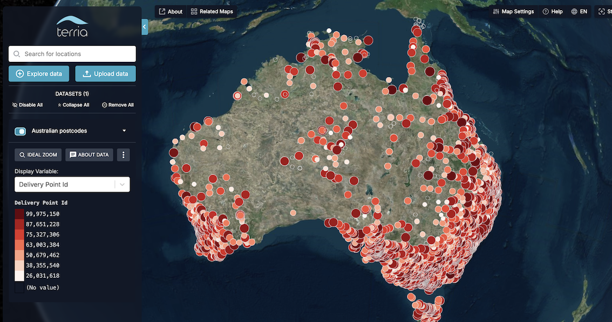
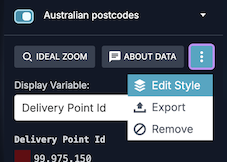
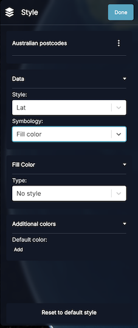

# Vector Data

## Overview

When you drag and drop a CSV file onto the map, TerriaJS selects some display defaults for you, including the size of the points, the color scale, how to cluster values in the legend, and more.

You can take control of these settings by writing a styling definition for the initialization file.

## Style Configuration

### Quick Start Example

Let's start with an example. Save this snippet as `example.json` and drag it onto the map:

```json
{
  "catalog": [
    {
      "name": "Australian postcodes",
      "type": "csv",
      "url": "https://tiles.terria.io/static/auspost-locations.csv"
    }
  ]
}
```

At first, it may seem as if nothing has happened. This is because JSON files instruct Terria to update the catalog rather than directly add data to the map. Head to the Data Catalog, and find the data item called "Australian postcodes". Add it to the map.

You will see numerous points across Australia styled with a color palette automatically chosen by Terria.


### Creating Style Definitions

The simplest way to create a new style definition is to:

1. Open the item dropdown menu and select "Edit style"

   

2. Make your styling changes in the style editing side panel

   

3. Access advanced styling options:
   - Click the kebab menu (⋮) next to the layer name
   - Choose "Show advanced options"
   - Click the kebab menu again and select "Copy user stratum to clipboard"

You will get something similar to:

```json
{
  "url": "https://tiles.terria.io/static/auspost-locations.csv",
  "name": "Australian postcodes",
  "styles": [
    {
      "id": "Description",
      "color": { "colorPalette": "HighContrast" },
      "hidden": false
    }
  ],
  "activeStyle": "Description"
}
```

In the example above, the ID in the `styles` array usually represents the column name, and the `activeStyle` is the ID of the currently active style. You can now combine this with the layer definition in your initialization file, and the layer will be styled as you defined it whenever a user adds a dataset to the map.
Let's delve further into the available options.

## Controlling data appearance in the workbench

### activeStyle

If you want the dataset to start with a different column selected, use `activeStyle`:

```json
  "activeStyle": "id-of-style"
```

### columns

If you want to change the appearance of individual columns, use the catalog items's [`columns` trait](https://docs.terria.io/guide/connecting-to-data/catalog-type-details/geojson/#tablecolumntraits), eg:

```json
"columns": [
  {
    "name": "original name",
    "title": "better name",
    "format": {
      "maximumFractionDigits": 0
    }
  },
  {
    "name": "bad",
    "type": "hidden"
  }
]
```

This example shows a few possibilities:

- A column called "original name" is displayed with the name "better name".
- The legend for that column is shown without any decimal places (i.e. `maximumFractionDigits` set to 0).
- A column in the original data called "bad" is hidden from the workbench.

### Specifying default column settings

It is also possible to specify default column settings that will be reused for all columns/properties. For example:

```json
"defaultColumn": {
  "replaceWithNullValues": ["NA"],
  "replaceWithZeroValues": ["-"]
}
```

### Configuration options

The complete list of available configuration options can be found in the catalog item documentation. For details, see https://docs.terria.io/guide/connecting-to-data/catalog-type-details/geojson/#tablecolumntraits.

## Styling

Styling can be defined for each column or as a default style for all columns/properties. To define the default style, specify the `defaultStyle` trait, with the style definition as the value. To define a style for a specific column, specify the `styles` trait as an array of objects and, within it, define the `id` as the `column/property` name. When applying the style definition, TerriaJS uses the property values to apply the appropriate variant of style. For a list of all available options, check [table style traits](https://docs.terria.io/guide/connecting-to-data/catalog-type-details/geojson/#tablestyletraits).

## Coloring

Use the following settings to adjust how data is colored.

TerriaJS supports these map style types:

- Constant color,
- Continuous color,
- Enum color, and
- Color binning

### Constant color

The constant color applies a single, fixed color to all features, regardless of their attributes. This is useful when you want to display features uniformly or highlight a specific dataset.

#### Basic example

```json
{
  "color": {
    "mapType": "constant",
    "nullColor": "rgba(221,16,16,1)"
  }
}
```

### Continuous color

Continuous color mapping creates a smooth gradient between colors based on numeric values. It is ideal for visualizing data that changes gradually, such as temperature, elevation, or density measurements.

#### Basic Example

```json
{
  "color": {
    "mapType": "continuous",
    "colorColumn": "temperature",
    "minimumValue": 0,
    "maximumValue": 100,
    "colorPalette": "Viridis"
  }
}
```

**Advanced Configuration**

```json
{
  "color": {
    "mapType": "continuous",
    "colorColumn": "elevation",
    "minimumValue": -100,
    "maximumValue": 1000,
    "colorPalette": "RdYlBu",
    "nullColor": "#cccccc",
    "nullLabel": "No Data",
    "outlierColor": "#ff0000",
    "outlierLabel": "Out of Range",
    "legendTicks": 7
  }
}
```

#### Configuration options

- `mapType`: Set to `"continuous"`
- `colorColumn`: Numeric column to map
- `minimumValue/maximumValue`: Range bounds
- `colorPalette`: Color gradient scheme
- `nullColor/nullLabel`: Handling missing data
- `outlierColor/outlierLabel`: Values outside range
- `legendTicks`: Number of tick marks to show in the legend

### Enum color

Enum color mapping assigns specific colors to categorical (enumerated) values in your data. It is useful for visualizing discrete categories such as land use types, administrative regions, or classification groups.

#### Basic example

```json
{
  "color": {
    "mapType": "enum",
    "colorColumn": "Description",
    "enumColors": [
      {
        "value": "Post Office",
        "color": "#ff0000"
      },
      {
        "value": "Business Center",
        "color": "#00ff00"
      }
    ],
    "nullColor": "#cccccc",
    "nullLabel": "Unclassified"
  }
}
```

#### Configuration options

- `mapType`: set to `"enum"`
- `colorColumn`: Column containing categorical values
- Color Schemes:
  - `enumColors`: Array of value-color pairs
  - `colorPalette`: Color palette to use when defining default enum colors map. It is ignored when `enumColors` are specified.
- Null Handling:
  - `nullColor`: Color for missing values
  - `nullLabel`: Legend label for null values

#### Color palette

Supported color palettes are [ColorBrewer](http://colorbrewer2.org/) and [d3-scale-chromatic](https://github.com/d3/d3-scale-chromatic)

### Color binning

Color binning divides numeric data into discrete categories or "bins" and assigns specific colors to each bin. This makes it easy to identify patterns and distributions in the data, which is useful for creating choropleth maps or visualizing grouped numeric data.

#### Use Cases

- Population density maps
- Income level visualization
- Temperature zones
- Risk assessment maps
- Statistical groupings

#### Configuration Options

- `mapType`: set to `"enum"`
- `colorColumn`: Column containing categorical values
- Number of Bins: Set using numberOfBins
- Custom Ranges: Define exact breaks using binMaximums
- Color Schemes:
  - Use built-in palettes with colorPalette
  - Define custom colors with binColors
- Null Handling:
  - nullColor: Color for missing values
  - nullLabel: Legend label for null values

##### Examples

**basic example**

```json
{
  "color": {
    "mapType": "bin",
    "colorColumn": "Delivery Point Id",
    "numberOfBins": 5,
    "colorPalette": "Blues"
  }
}
```

**Custom binning**

```json
{
  "color": {
    "mapType": "bin",
    "colorColumn": "income",
    "binMaximums": [30000, 50000, 75000, 100000, 150000],
    "binColors": ["#fee5d9", "#fcae91", "#fb6a4a", "#de2d26", "#a50f15"],
    "nullColor": "#eeeeee",
    "nullLabel": "No data available"
  }
}
```

_Note: If there are more colors than bins, any extra colors will be disregarded. If there are more bins than colors, the colors will be repeated._

#### Color palette

Supported color palettes are [ColorBrewer](http://colorbrewer2.org/) and [d3-scale-chromatic](https://github.com/d3/d3-scale-chromatic)

## Points

Two style traits can be used to control the point styling:

- `point` and
- `pointSize`.

### Point style

#### Default point style

To specify the default point style that will be applied to all points, you can define a null trait style.

```json
{
  "id": "style-id",
  "point": {
    "null": {
      "marker": "heart",
      "rotation": 0,
      "height": 20,
      "width": 20
    }
  }
}
```

When the above style definition is applied to the point dataset, all points will be displayed as hearts on the map. The marker can be a [data URI](https://developer.mozilla.org/en-US/docs/Web/HTTP/Basics_of_HTTP/Data_URLs) or one of the supported [Maki icons](https://labs.mapbox.com/maki-icons/) (for example, "hospital").

#### Enum point styling

```json
{
  "id": "style-id",
  "point": {
    "mapType": "enum",
    "column": "Description",
    "enum": [
      {
        "marker": "post",
        "rotation": 0,
        "height": 25,
        "width": 25,
        "value": "Post Office"
      },
      {
        "marker": "telephone",
        "rotation": 0,
        "height": 30,
        "width": 30,
        "value": "Community Postal Agency"
      },
      {
        "marker": "building",
        "rotation": 0,
        "height": 30,
        "width": 30,
        "value": "Business Centre"
      }
    ]
  }
}
```

#### Bin point styling

```json
{
  "id": "style-id",
  "point": {
    "enabled": true,
    "mapType": "bin",
    "column": "Delivery Point Id",
    "bin": [
      {
        "marker": "building",
        "rotation": 0,
        "height": 16,
        "width": 16,
        "maxValue": 45000000
      },
      {
        "marker": "building-alt1",
        "rotation": 0,
        "height": 16,
        "width": 16,
        "maxValue": 90000000
      }
    ]
  },
  "hidden": false
}
```

### Point size

To define the point size in terms of scalar data, you can use the `pointSize` trait. The size of a point in pixels will be calculated using the formula `Normalized Value * Size Factor + Size Offset`, where the `Normalized Value` is a value within the range of 0 to 1, with 0 representing the lowest value in the column and 1 representing the highest.

```json
{
  "id": "style-id",
  "pointSize": {
    "pointSizeColumn": "population",
    "nullSize": 10,
    "sizeFactor": 14,
    "sizeOffset": 12
  }
}
```

## Outline styling

You can use the outline styling trait to specify the vector data outline and color. It supports default, bin, and enum styling as points. All options are the same just different color scheme is applied.

### Default outline style

To specify the default outline style you can use `outline.null` trait

```json
{
  "outline": {
    "null": {
      "width": 4,
      "color": "#ff0000"
    }
  }
}
```

### Enum styling

To define exact styling based on property values it is possible to use enum color maps.

```json
"outline": {
  "mapType": "enum",
  "column": "Description",
  "enum": [
    { "color": "#ff0000", "width": 4, "value": "Post Office" },
    {
      "color": "#00ff00",
      "width": 4,
      "value": "Community Postal Agency"
    },
    {
      "color": "#0000ff",
      "width": 4,
      "value": "Business Centre"
    }
  ],
  "null": { "color": "#ffffff", "width": 4 }
},
```

With the above styling, the post offices will have a red outline, postal agencies will have a green outline, and business centres will have a blue outline, while any outliers will have a white outline.

### Bin styling

Most details regarding bin styling are the same as those in the coloring section of this guide.

#### Basic example

```json
{
  "outline": {
    "mapType": "bin",
    "column": "Delivery Point Id",
    "numberOfBins": 3,
    "bin": [
      { "color": "#fee0d2", "width": 1, "maxValue": 30000000 },
      { "color": "#fc9272", "width": 2, "maxValue": 60000000 },
      { "color": "#de2d26", "width": 3, "maxValue": 90000000 }
    ],
    "null": { "color": "#cccccc", "width": 1 }
  }
}
```

## Labels

To define the dataset labels, you can specify the `labels` trait. By default, labels are disabled: therfore, you will need to set `"enabled": true` for them to be displayed on the map. For example:

```json
"label": {
  "enabled": true,
  "null": {
    "labelColumn": "Name",
    "font": "8px sans-serif",
    "style": "fill"
  }
}
```

To view a list of all available options check [LabelStyleTraits](https://docs.terria.io/guide/connecting-to-data/catalog-type-details/geojson/#tablelabelstyletraits)

## Legend

Terria will automatically generate the legend based on the parameters supplied in the style definition; however, if you are not satisfied with these, you can customise the details yourself. The available configuration options are:

- `title`: Title displayed above the legend.
- `url`: URL for the legend image.
- `urlMimeType`: MIME type for the legend URL, enabling Terria to load and display the image correctly. This is necessary unless the URL ends with `png`, `jpg`, `jpeg`, `gif`, or `svg`.
- `imageScaling`: Scaling of the legend image, which is useful for images with high DPI that require scaling down.
- `backgroundColor`: A custom background for the legend that can be defined when the legend is transparent and clashes with Terria's UI styles.
- `items`: Custom list of legend items. For all available options, check [LegendItemTraits](https://docs.terria.io/guide/connecting-to-data/catalog-type-details/geojson/#legenditemtraits).

### Example

```json
{
  "legend": {
    "title": "Custom Legend",
    "items": [
      {
        "color": "#ff0000",
        "title": "High Value"
      },
      {
        "color": "#00ff00",
        "title": "Low Value"
      }
    ]
  }
}
```

## Manipulating time

### timeColumn

You can set which column controls the time slider by setting `timeColumn`:

```json
"time": {
  "timeColumn": "name-of-column"
}
```

Use `"timeColumn": null` to remove the time slider altogether for this dataset.

### endTimeColumn

If you have data that show feature existence over a time interval, you can specify the `endTimeColumn`.

```json
"time": {
  "timeColumn": "name-of-column",
  "endTimeColumn": "name-of-end-column"
}
```

### idColumns

If you have data that shows particular features over time, you can have a time-series plot of the selected column values to appear in the feature info panel when you click on a feature, provided you inform TerriaJS how to track individual features over time.

If your table includes a time column alongside a column named `id`, this will happen automatically.

Otherwise, you can specify which column or columns to use for the feature IDs by setting `idColumns`. This should be an array of column names, for example:

```json
  "idColumns": ["feature name"],
```

If your features have fixed latitude and longitude positions, you could use:

```json
  "idColumns": ["lat", "lon"],
```

## Trail Styling

Trails illustrate the trajectory of moving features over time.

### Example

```json
{
  "type": "csv",
  "url": "test/incidents.csv",
  "activeStyle": "incident_duration",
  "defaultStyle": {
    "color": {
      "binColors": [
        "rgba(0,0,200,1.0)",
        "rgba(200,200,200,1.00)",
        "rgba(200,0,0,1.00)"
      ],
      "numberOfBins": 3
    }
  },
  "multiplier": 64006.5306122449,
  "isPaused": false,
  "styles": [
    {
      "id": "incident_duration",
      "trail": {
        "enabled": true,
        "mapType": "bin",
        "column": "incident_severity",
        "materialType": "polylineGlow",
        "bin": [
          {
            "polylineGlow": {
              "color": "rgba(17,31,233,1)"
            },
            "trailTime": 100000,
            "resolution": 60000,
            "maxValue": 3
          },
          {
            "polylineGlow": {
              "color": "rgba(237,14,14,1)"
            },
            "leadTime": 0,
            "trailTime": 100000,
            "width": 30,
            "resolution": 60000,
            "maxValue": 4
          }
        ]
      },
      "hidden": false
    }
  ]
}
```

### Configuration Options

- `enabled`: Enable or disable trails (default: false)
- `materialType`: "solidColor" or "polylineGlow"
- Time settings:
  - `trailTime`: Seconds to display behind the object (default: 10)
  - `leadTime`: Seconds to display ahead of the object (default: 0)
  - `resolution`: Maximum seconds between samples (default: 60)
- Style:
- `width`: Line width in pixels
  - Color options based on materialType

## Related Resources

- [TerriaJS Style Traits Documentation](https://docs.terria.io/guide/connecting-to-data/catalog-type-details/geojson/#tablestyletraits)
- [Maki Icons Reference](https://labs.mapbox.com/maki-icons/)
- [ColorBrewer Schemes](http://colorbrewer2.org/)
