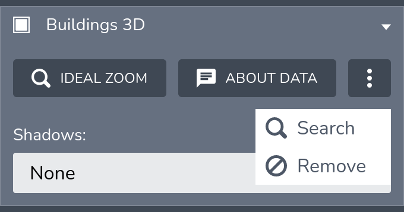

This section explains how to make an item searchable using the [ItemSearchProvider](../../lib/Models/ItemSearchProvider) API.

## Item search provider

TerriaJS provides an `ItemSearchProvider` API for defining custom search providers for your [catalog Item](../connecting-to-data/catalog-items.md).

## Available search providers

- [Indexed item search provider](item-search/indexed-item-search.md)

## Configuring the catalog item for searching

Sample configuration:

```
  {
    "name": "Buildings 3D",
    "type": "3d-tiles",
    "url": "Buildings3D/tileset.json",
    "search": {
      "providerType": "indexed",
      "providerOptions": {
        "indexRootUrl": "/Buildings3D-index/indexRoot.json"
      },
      "resultTemplate": "Building #{{OBJECTID}}",
      "parameters": [
         {
           id: "GEOSCAPE_ROOF_SLOPE",
           name: "Roof Slope"
         },
         {
           id: "GEOSCAPE_STREET_ADDRESS",
           queryOptions: {
             prefix: true,
             fuzzy: 2
           }
         }
      ]
    }
  }
```

The catalog item definition contains a `search` configuration which defines the item search provider type and the provider specific options.

## Opening the search tool

The search tool can be opened from the expand menu for the catalog item in the workbench.



## Future implementations

- GeoJSON search provider, for searching inside a geojson catalog item using its properties.
- WPS search provider, for searching any item using a remote server.

## Implementing your own search provider

You can implement your own custom search provider by providing a class that implements the `ItemSearchProvider` API and registering it as a search provider using the [registerItemSearchProvider](../../lib/Models/ItemSearchProviders/ItemSearchProviders.ts) method.

```
  import ItemSearchProvider from "lib/Models/ItemSearchProvider";
  import { registerItemSearchProvider } from "lib/Models/ItemSearchProviders";

  class MyCustomItemSearchProvider extends ItemSearchProvider {
    ...
  }

  registerItemSearchProvider(
    "my-custom-item-search-provider",
    MyCustomItemSearchProvider
  );
```

You also need to ensure that your catalog item adds the [SearchableItemMixin](../../lib/ModelMixins/SearchableItemMixin.ts).
