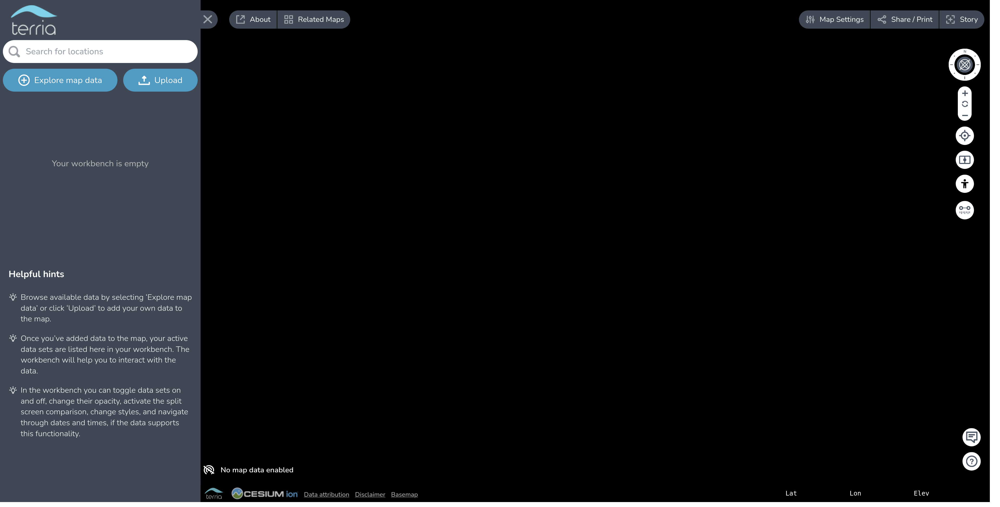

### Problem

TerriaJS app is accessible at `http://localhost:3001` but it does not render a map.



### Workaround

The default TerriaJS configuration uses Cesium Ion for serving some of its basemaps. If the Cesium Ion access token has expired then these basemaps will fail to render. We recommend that you [register](https://cesium.com/ion/signup/) and use your own Cesium Ion access token. Please see the documentation on [client side configuration](../customizing/client-side-config.md#parameters) for configuring your access token. Also note that it is a violation of the Ion terms-of-use to use the default key in a deployed application.

---

### Problem

Building TerriaMap (without yarn workspaces) throws an error like:

```
You have two copies of terriajs-cesium
```

### Solution

Check:

```
yarn list terriajs-cesium
```

If there are 2 different versions listed, run:

```
yarn gulp sync-terriajs-dependencies
```

If there's only 1 version listed in 2 places your yarn lockfile is playing up. To fix it, you could use [yarn-deduplicate](https://www.npmjs.com/package/yarn-deduplicate) or try reverting to a known good commit of your lockfile, and then run `yarn install` again.

---

### Problem

When using yarn workspaces to develop a TerriaMap against a custom version of terriajs `yarn install` throws error

```
An unexpected error occurred: "expected workspace package to exist for \"pkg-dir\""
```

or a similar error with a different package.
Sometimes yarn versions after yarn@1.19.0 will cause an error when running yarn install using workspaces. The Github issue describing it https://github.com/yarnpkg/yarn/issues/7807 has comments saying it’s caused by a workspace trying to install a different version of the same dependency.

### Workaround

Easiest fix is to install dependencies using an older version of yarn:

```
npx yarn@1.19.0 install
```

It’s possible the problem could also be fixed in certain cases by syncing dependency versions for the same package, and ensuring that a workspace doesn’t install the same dependency but with a different version. Syncing dependencies could help:

```
yarn gulp sync-terriajs-dependencies
```

---

### Problem

I have already have NodeJS installed, but I need an early version for TerriaJS

### Solution

You can use [nvm](https://github.com/nvm-sh/nvm#installing-and-updating) to manage multiple versions of NodeJS.

Follow installation instructions [here](https://github.com/nvm-sh/nvm#installing-and-updating).

Then run the following to install NodeJS v16 and use it:

```bash
nvm install 16
nvm use 16
```

### Problem

When building TerriaMap/TerriaJS I see the following error

```
Error: error:0308010C:digital envelope routines::unsupported
```

### Solution

For NodeJS versions 18 and above you will need to set `NODE_OPTIONS=--openssl-legacy-provider` in your environment.
