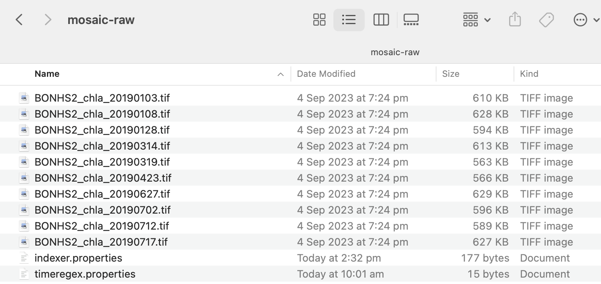
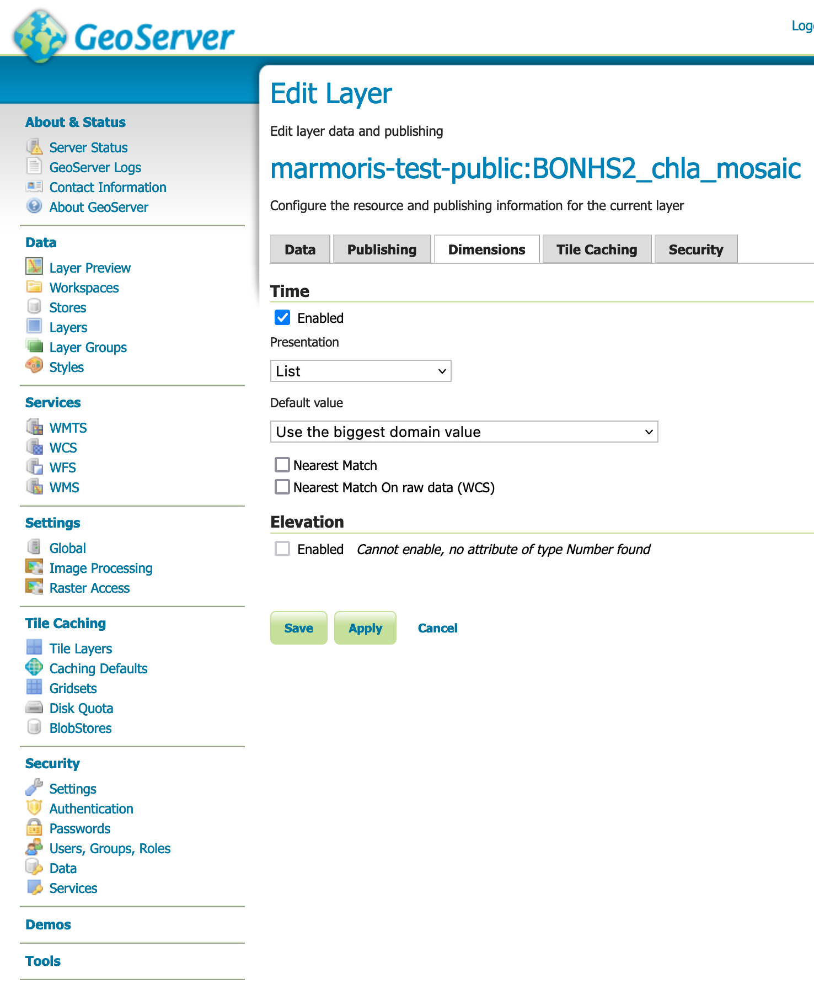

# Creating Time-series ImageMosaic Layers in GeoServer

This guide shows how to create an ImageMosaic layer in GeoServer with a time dimension. Once created, the WMS layer can be added to TerriaMap and displayed as a time series.

For more details, see the official GeoServer tutorial: https://docs.geoserver.org/latest/en/user/data/raster/imagemosaic/tutorial.html

## Set up data folder

- Place all single-band GeoTIFFs into a folder in GeoServer's `data_dir`
  - Each filename must contain an 8-digit timestamp in `YYYYMMDD` format (e.g., `BONHS2_chla_20190717.tif`)
- Add `indexer.properties` and `timeregex.properties` configuration files to the folder (see below)
  - Your folder structure should look like this:  
    

### `indexer.properties`

```properties
Schema=*the_geom:Polygon,location:String,time:java.util.Date
PropertyCollectors=TimestampFileNameExtractorSPI[timeregex](time)
TimeAttribute=time
Caching=true
AbsolutePath=false
```

### `timeregex.properties`

```properties
regex=[0-9]{8}
```

For more information about these configuration files, see: https://docs.geoserver.org/latest/en/user/data/raster/imagemosaic/configuration.html

## Create data store and layer in GeoServer

- Create a new "ImageMosaic" raster data source and select the folder containing your GeoTIFFs and `.properties` files
- Publish the mosaic layer
- Enable the time dimension as shown:  
  
- Configure the layer styling

### Example style

This example uses a GnBu color ramp with values from 0.25 to 0.45:


```xml
<?xml version="1.0" encoding="UTF-8"?>
<StyledLayerDescriptor xmlns="http://www.opengis.net/sld" xmlns:sld="http://www.opengis.net/sld" version="1.0.0" xmlns:gml="http://www.opengis.net/gml" xmlns:ogc="http://www.opengis.net/ogc">
  <UserLayer>
    <sld:LayerFeatureConstraints>
      <sld:FeatureTypeConstraint/>
    </sld:LayerFeatureConstraints>
    <sld:UserStyle>
      <sld:Name>raster-gnbu</sld:Name>
      <sld:FeatureTypeStyle>
        <sld:Rule>
          <sld:RasterSymbolizer>
            <sld:ChannelSelection>
              <sld:GrayChannel>
                <sld:SourceChannelName>1</sld:SourceChannelName>
              </sld:GrayChannel>
            </sld:ChannelSelection>
            <sld:ColorMap type="ramp">
              <sld:ColorMapEntry label="0.25" quantity="0.25" color="#f0f9e8"/>
              <sld:ColorMapEntry label="0.30" quantity="0.30" color="#bae4bc"/>
              <sld:ColorMapEntry label="0.35" quantity="0.35" color="#7bccc4"/>
              <sld:ColorMapEntry label="0.40" quantity="0.40" color="#43a2ca"/>
              <sld:ColorMapEntry label="0.45" quantity="0.45" color="#0868ac"/>
            </sld:ColorMap>
          </sld:RasterSymbolizer>
        </sld:Rule>
      </sld:FeatureTypeStyle>
    </sld:UserStyle>
  </UserLayer>
</StyledLayerDescriptor>
```

## Notes

### Multiple dimensions

You can include more than one dimension in your mosaic. The [documentation](https://docs.geoserver.org/latest/en/user/data/raster/imagemosaic/configuration.html#index-and-configuration-file-creation) shows an example of extracting `elevation` from filenames. Each dimension will appear as a dropdown menu in TerriaMap's workbench.
