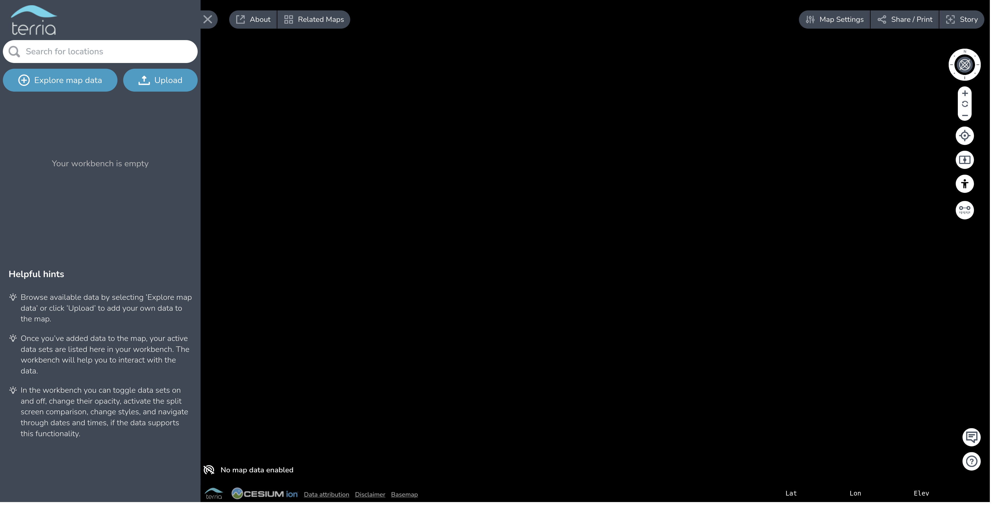

### Problem

TerriaJS app is accessible at `http://localhost:3001` but it does not render a map.



### Workaround

The default TerriaJS configuration uses Cesium Ion for serving some of its basemaps. If the Cesium Ion access token has expired then these basemaps will fail to render. We recommend that you [register](https://cesium.com/ion/signup/) and use your own Cesium Ion access token. Please see the documentation on [client side configuration](../customizing/client-side-config.md#parameters) for configuring your access token. Also note that it is a violation of the Ion terms-of-use to use the default key in a deployed application.

---

### Problem

The build throws an error like:

```
You have two copies of terriajs-cesium
```

### Solution

Both `packages/terriajs` and `apps/terriamap` depend on `terriajs-cesium`. If their declared versions have drifted apart — usually because it was bumped in TerriaJS but not in TerriaMap — pnpm installs two copies. Check with:

```
pnpm why terriajs-cesium
```

If more than one version is listed, update the `terriajs-cesium` version in `apps/terriamap/package.json` to match the one in `packages/terriajs/package.json`, then run `pnpm install`.

---

### Problem

I already have NodeJS installed, but I need the version TerriaJS expects.

### Solution

You can use [nvm](https://github.com/nvm-sh/nvm#installing-and-updating) to manage multiple versions of NodeJS.

Follow installation instructions [here](https://github.com/nvm-sh/nvm#installing-and-updating).

The repo pins its Node version in `.nvmrc`, so from the repo root you can run:

```bash
nvm install   # installs the version in .nvmrc
nvm use       # switches to it
```

---

### Problem

A build fails with `Module not found` (or a TypeScript `Cannot find module`) for a package you can see is used.

### Solution

It is most likely an undeclared dependency. pnpm's isolated `node_modules` only exposes the packages a project actually declares, so an import that used to resolve through hoisting now fails. Add the missing package to that project's `package.json` (`dependencies` or `devDependencies`) and run `pnpm install` — don't rely on a transitive dependency being reachable.
