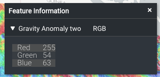

Add a `featureInfoTemplate` to the items in your catalog `json` file, like so:

    {
      "catalog": [
        {
          "name": "ArcGIS Server",
          "type": "group",
          "items": [
            {
              "name": "Gravity Anomaly two",
              "type": "esri-mapServer",
              "url": "http://www.ga.gov.au/gisimg/rest/services/earth_science/Geoscience_Australia_National_Geophysical_Grids/MapServer/6",
              "attribution" :
                {
                  "text" : "Geoscience Australia",
                  "link" : "http://www.ga.gov.au"
                },
              "featureInfoTemplate" : "Pixel colour: <b>Red={{Red}} Blue={{Blue}} Green={{Green}}</b>."
            }
          ]
        }
      ]
    }

The template will replace all occurrences of `{{property}}` with the value of the property for that feature.

The result is:


instead of:



You can provide a template to use for the name of the collapsible section (eg. to replace `RGB` in the example above), like so:

              "featureInfoTemplate" : {
                  "template": "<div>Pixel colour: {{>foobar}}</div>",
                  "name": "Red {{Red}}"
              }

## More details

The template is rendered using [Mustache](https://github.com/janl/mustache.js#usage), so you can use all of its features here.

In particular, you can render properties that include html by using triple-braces, eg. `{{{property}}}`.

You can make use of partial templates (and even recursive templates) by specifying your template and partials as a json object, eg.:

              "featureInfoTemplate" : {
                  "template": "<div>Pixel colour: {{>foobar}}</div>",
                  "partials": {
                      "foobar": "<b>Red={{Red}} Blue={{Blue}} Green={{Green}}</b>"
                  }
              }

After Mustache has rendered the template, the result is displayed using [Markdown](https://help.github.com/articles/markdown-basics/), so you could also write:

              "featureInfoTemplate" : "Pixel colour: *Red={{Red}} Blue={{Blue}} Green={{Green}}*."

## Formatting numbers

The preferred way to format numbers is using the `formats` option, eg:

              "featureInfoTemplate": {
                "template": "Pixel colour: <b>Red={{Red}} Blue={{Blue}} Green={{Green}}</b>.",
                "formats": {
                  "Red": {
                    "maximumFractionDigits": 2
                  },
                  "Green": {
                    "maximumFractionDigits": 2
                  },
                  "Blue": {
                    "maximumFractionDigits": 2
                  }
                }
              }

The supported format options are `"maximumFractionDigits": X` (to set the number of decimal places to X), `"useGrouping": true` (to show thousands separators), and `"style": "percent"` (eg. to show 0.15 as 15%).

A second method is to use `terria.formatNumber` directly in the template. This accepts an initial JSON string describing the same options as above. To simplify the notation, the quotes around the keys are optional here.

              "featureInfoTemplate": "template": "Pixel colour: <b>Red={{#terria.formatNumber}}{maximumFractionDigits:3}{{Red}}{{/terria.formatNumber}}</b>."

## URL-encoding strings

To URL-encode a value in a template, use `terria.urlEncode` or `terria.urlEncodeComponent`.  For example:

    Test: {{#terria.urlEncode}}http://example.com/a b{{/terria.urlEncode}}
    Test: {{#terria.urlEncodeComponent}}W/HOE#1{{/terria.urlEncodeComponent}}

## Time-series charts

For features with time-varying table-based data structures (eg. CSV, SOS2, SDMX-JSON, if there is a time column), the feature info panel also includes a chart of the data over time, eg.


You can place this chart in your template using `{{terria.timeSeries.chart}}`.  Alternatively, you can access the following component information:
- `{{terria.timeSeries.xName}}` - the x-column name, with any double-quotes removed.
- `{{terria.timeSeries.yName}}` - the y-column name, with any double-quotes removed.
- `{{terria.timeSeries.title}}`
- `{{terria.timeSeries.id}}`
- `{{terria.timeSeries.units}}` - the column units as a comma-separated string.
- `{{terria.timeSeries.data}}` - the data as a comma-separated string.

So you could reconstruct the chart manually as:
```
<h4>{{terria.timeSeries.title}}</h4>
<chart x-column="{{terria.timeSeries.xName}}"
       y-column="{{terria.timeSeries.yName}}"
       id="{{terria.timeSeries.id}}"
       units="{{terria.timeSeries.column-units}}">
    {{terria.timeSeries.data}}
</chart>
```
or use this as a basis to customise the chart.

## Other supporting data

The clicked point's latitude and longitude are also available as `{{terria.coords.latitude}}` and `{{terria.coords.longitude}}`.
